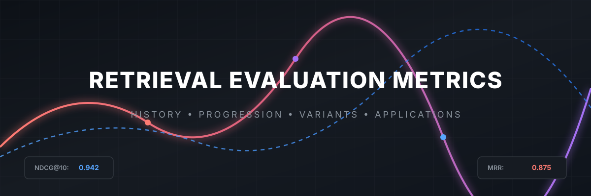
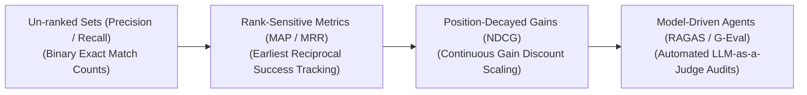
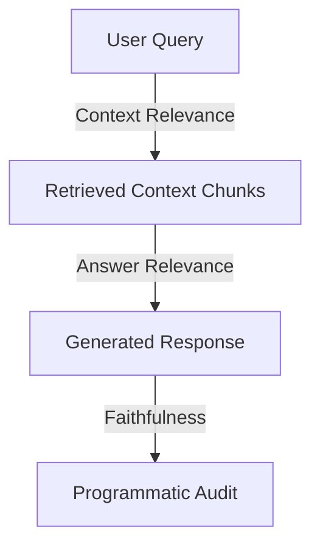

# Awesome-Retrieval-Evaluation-Metrics

  

## 📊 Retrieval Evaluation Metrics: History, Progression, Variants, & Applications

Retrieval Evaluation Metrics are the quantitative mathematical frameworks used to measure the accuracy, structural quality, and contextual relevance of Search Engines, Recommendation Systems, and Information Retrieval infrastructure. In modern artificial intelligence, evaluating retrieval is the foundational diagnostic pillar underpining **Retrieval-Augmented Generation (RAG)** stacks and vector databases. While classical database lookups rely on binary exact-match triggers, semantic vector search operates over volatile statistical similarity manifolds. Retrieval metrics allow machine learning engineers to definitively profile whether a system can source information-dense context chunks from vast unstructured repositories, surface the most critical details first, and eliminate irrelevant background noise before downstream processing or text synthesis occurs.

---

## 🕰️ 1. The Macro Chronological Evolution

The technical framework governing retrieval assessment has transitioned from un-ranked categorical tracking to complex, rank-weighted decay matrices and modern multi-modal, model-driven evaluation agents.

| Era / Phase | Concept & Limitation | First Used (Year) | Seminal Paper / Reference |
| :--- | :--- | :--- | :--- |
| [**The Un-ranked Set Era (Classical Information Retrieval, ~1960s–1990s)**](details/unranked_set_era.md) | **Concept:** The structural baseline born during the dawn of computerized document indexing. Evaluation treated search results as an unordered bucket or set of documents. Systems were scored using binary intersections: counting the absolute number of relevant documents returned (**Precision**) versus the total number of relevant documents that existed globally in the database (**Recall**).  **Limitation:** Rank-blind. It treated a critical document returned as the very first result identically to a document buried at position index 50, making it unviable for tracking modern page routing interfaces. | 1955 | [Kent et al. (1955)](https://doi.org/10.1002/asi.5090060209) |
| [**The Rank-Sensitive Position Era (~1990s–2010s)**](details/rank_sensitive_position_era.md) | **Concept:** Driven by the explosion of web search engines (like early Google or Yahoo) where user focus drops off rapidly after the first few links. Metrics evolved to prioritize position order. **Mean Reciprocal Rank (MRR)** was engineered to score search strings based entirely on the reciprocal position index of the *first correct result*, while **Mean Average Precision (MAP)** aggregated precision scores across multiple contiguous precision thresholds.  **Limitation:** Bounded to binary data boundaries (a document was rigidly scored as either 100% relevant or 0% relevant, with zero intermediate nuance). | 1999 | [Voorhees (1999)](http://trec.nist.gov/pubs/trec8/papers/qa_report.pdf) |
| [**The Continuous Relevance & Discounted Gain Era (~2000s–2022)**](details/continuous_relevance_era.md) | **Concept:** Standardized by **Normalized Discounted Cumulative Gain (NDCG)**. It bypassed binary limitations by introducing multi-level graded relevance scales (e.g., scoring a document on a nuanced scale from 0 to 3: `[0: Irrelevant, 1: Partially Useful, 2: Highly Relevant, 3: Perfect Match]`). It couples this with a logarithmic decay formula that progressively penalizes the score the further down a highly useful document is buried in the output list. | 2000 | [Järvelin & Kekäläinen (2000)](https://doi.org/10.1145/345508.345545) |
| [**The Model-Driven RAG Alignment Era (~2023–Present)**](details/model_driven_rag_alignment_era.md) | **Concept:** The current modern state-of-the-art diagnostic baseline. Driven by the complex requirements of production RAG architectures. Traditional metrics measure whether text strings match, but completely fail to detect structural hallucinations, context dilution, or semantic coverage holes. Modern frameworks—such as **Ragas**, **TruLens**, and **G-Eval**—deploy **LLM-as-a-Judge model agents** to audit retrieval. They read the user query, the extracted document chunks, and the finalized model output concurrently, outputting automated continuous scores for specialized parameters like **Context Relevance**, **Faithfulness**, and **Answer Grounding** natively. | 2023 | [Es et al. (2023)](https://arxiv.org/abs/2309.15217) |

---

## 🧮 2. Core Mathematical & Rank-Based Variants

Retrieval evaluation frameworks are strictly categorized based on how the mathematical equations partition data blocks and account for token positional indices.

| Variant | Mathematical Mechanism, Pros & Cons, or Application / Significance | First Used (Year) | Seminal Paper / Reference |
| :--- | :--- | :--- | :--- |
| [**Binary Precision at K (P@K)**](details/precision_at_k.md) | **Mechanism:** Measures the exact ratio of relevant documents within the absolute top $K$ retrieved entries: $$\text{Precision@K} = \frac{\text{Number of Relevant Documents in Top K}}{K}$$ **Pros:** Highly interpretable and straightforward to monitor across commercial search dashboards. **Cons:** Highly volatile if $K$ is set poorly, and completely blind to the arrangement order within that top $K$ block. | 1955 | [Kent et al. (1955)](https://doi.org/10.1002/asi.5090060209) |
| [**Mean Reciprocal Rank (MRR)**](details/mrr.md) | **Mechanism:** Evaluates the system's ability to return the absolute best result immediately. It isolates the position rank ($k$) of the *very first relevant item* in the output list, computing its reciprocal value: $$\text{MRR} = \frac{1}{M} \sum_{i=1}^{M} \frac{1}{k_i}$$ **Application:** The default infrastructure optimizer for single-answer lookup engines, such as conversational FAQ bots or targeted e-commerce product SKU finders. | 1999 | [Voorhees (1999)](http://trec.nist.gov/pubs/trec8/papers/qa_report.pdf) |
| [**Normalized Discounted Cumulative Gain (NDCG@K)**](details/ndcg.md) | **Mechanism:** Calculates the continuous logarithmic decay of graded document gains ($rel_i$) across sequence positions: $$\text{DCG@K} = \sum_{i=1}^{K} \frac{2^{rel_i} - 1}{\log_2(i + 1)}$$ The final score is normalized ($\text{NDCG} = \frac{\text{DCG}}{\text{IDCG}}$) against an Ideal DCG (the score achieved if the database returned the documents in perfect mathematical relevance order). **Significance:** The gold-standard evaluation layer for complex recommendation grids and dense vector search ranking optimization. | 2000 | [Järvelin & Kekäläinen (2000)](https://doi.org/10.1145/345508.345545) |

---

## 🤖 3. Advanced Model-Driven RAG Evaluation Pillars

To safeguard large language models from generating factually corrupt or ungrounded responses, contemporary post-training evaluation loops deploy the "RAG Triad" agentic framework.

| RAG Evaluation Pillar | The Audit | First Used (Year) | Seminal Paper / Reference |
| :--- | :--- | :--- | :--- |
| [**Context Relevance (Precision Oversight)**](details/context_relevance.md) | Evaluates the quality of the vector database retrieval phase. An automated LLM judge scans the incoming user query alongside the extracted text chunks, calculating whether the retrieved fragments contain information-dense parameters necessary to solve the task, isolating and penalizing background data noise. | 2023 | [Es et al. (2023)](https://arxiv.org/abs/2309.15217) |
| [**Faithfulness / Groundedness (Hallucination Control)**](details/faithfulness_groundedness.md) | Measures absolute factual alignment. The model parses the generated response text, breaking it down into independent semantic claims. It checks each claim directly against the retrieved context shards. Any generated fact that cannot be explicitly verified or traced back to the source documents is flagged as a hallucination, dropping the faithfulness score. | 2023 | [Es et al. (2023)](https://arxiv.org/abs/2309.15217) |
| [**Answer Relevance (Semantic Alignment)**](details/answer_relevance.md) | Ensures the system provides an actual, targeted resolution. It reads the final output text alongside the initial user prompt to verify that the agent didn't drift into generic conversational sycophancy or bypass complex constraints, ensuring outputs remain highly helpful. | 2023 | [Es et al. (2023)](https://arxiv.org/abs/2309.15217) |

---

## ⚙️ 4. Production Engineering Challenges & Mitigations

Deploying and scaling complex retrieval evaluation metrics across enterprise production pipelines introduces critical computational and validation constraints.

| Production Challenge | Problem & Mitigation | First Used (Year) | Seminal Paper / Reference |
| :--- | :--- | :--- | :--- |
| [**The High Cost and Latency of Agentic LLM Evaluation**](details/agentic_llm_eval_cost.md) | **The Problem:** Querying a massive, multi-billion parameter model (like GPT-4) to judge every individual query-context pair generated across millions of production logs is economically unviable and introduces severe processing latencies that stall automated MLOps regression testing loops.  **Mitigation:** Implementing **Heuristic Token Proxies (Bi-Encoder Score Monitoring)** during active user streaming, while routing batches of logs through highly compact, distilled open-weights evaluation models (such as Prometheus or specialized 8B judge variants) running locally on offline server nodes. | 2023 | [Kim et al. (2023)](https://arxiv.org/abs/2310.08491) |
| [**The Data Contamination and Static Label Decay Wall**](details/data_contamination_label_decay.md) | **The Problem:** Building an evaluation dataset requires human experts to curate explicit query-document ground-truth matrices. Over time, as corporate knowledge bases shift, API documentation updates, or models undergo domain drift, these static datasets decay, leading to false metric readings.  **Mitigation:** Shifting toward **Dynamic LLM Synth-Test Generation**, leveraging automated agentic pipelines to continuously parse production user traffic, synthesize novel, un-contaminated evaluation sets, and update the testing matrix dynamically under automated verification constraints. | 2023 | [Saad-Falcon et al. (2023)](https://arxiv.org/abs/2311.09476) |

---

## 🚀 5. Frontier Real-World AI Applications

| Application Field | Description | First Used (Year) | Seminal Paper / Reference |
| :--- | :--- | :--- | :--- |
| [**Continuous MLOps Regression Tracking for Enterprise RAG Stacks**](details/mlops_regression_tracking.md) | Guides infrastructure optimization loops for enterprise vector search engines. When comparing different embedding models, chunking strategies, or reranking filters, automated evaluation harnesses process test suites through NDCG and Context Relevance metrics concurrently to isolate performance gains cleanly [INDEX: 18]. | 2023 | [Es et al. (2023)](https://arxiv.org/abs/2309.15217) |
| [**Automated Corporate E-Discovery & Legal Audit Verification**](details/e_discovery_legal_audit.md) | Processes millions of unstructured legal documents and municipal contracts. Deep Cross-Encoder rerankers and automated judge models evaluate semantic layout compliance and document extraction metrics, ensuring hidden litigation parameters are surfaced accurately before human review. | 2006 | [Baron et al. (2006)](http://trec.nist.gov/pubs/trec15/papers/LEGAL06.OVERVIEW.pdf) |
| [**High-Volume Healthcare Diagnostic Information Retrieval**](details/healthcare_diagnostic_ir.md) | Regulates medical diagnostic decision support bots. Clinical assistants look up patient electronic health records (EHR) interleaved with pharmacology databases. Strict Faithfulness and Groundedness metrics audit the pipeline continuously, ensuring any proposed multi-drug treatment course matches verified text data, blocking diagnostic liability loops. | 2004 | [Hersh et al. (2004)](https://trec.nist.gov/pubs/trec13/papers/GEO.OVERVIEW.pdf) |

---

## 📚 References
1. Salton, G., & McGill, M. J. (1986). *Introduction to modern information retrieval*. McGraw-Hill.
2. Järvelin, K., & Kekäläinen, J. (2002). Cumulated gain-based evaluation of IR techniques. *ACM Transactions on Information Systems (TOIS)*, 20(4), 422-446.
3. Voorhees, E. M. (2005). TREC: Experiment and evaluation in information retrieval. *MIT Press*.
4. Reimers, N., & Gurevych, I. (2019). Sentence-BERT: Sentence embeddings using Siamese BERT-networks. *Proceedings of the 2019 Conference on Empirical Methods in Natural Language Processing (EMNLP)* [INDEX: 18].
5. Es, S., et al. (2023). Ragas: Automated evaluation of retrieval augmented generation. *arXiv preprint arXiv:2309.15217*.
6. Shieh, J. (2024). TruLens: Evaluating and tracking large language model applications via programmatic metrics alignment. *AI Quality Infrastructure Whitepaper*.

---

To advance this documentation repository, benchmarking infrastructure, or automated MLOps framework, consider exploring these adjacent development pathways:
* Build a **Python script using the `ragas` or `truelens` libraries** demonstrating how to load a local dataset of question-context-answer triplets and compute automated Context Relevance and Faithfulness scores.
* Generate a **comprehensive Markdown table** explicitly analyzing Precision@K, Recall@K, MAP, MRR, NDCG, and LLM-as-a-Judge Metrics across mathematical limits, sensitivity to document rank ordering, requirement for continuous graded relevance labels, and infrastructure computational cost.
* Establish an **automated evaluation harness using Docker containers** to profile the exact wall-clock throughput and processing latency metrics achieved when running an enterprise checkpoint testing matrix through a localized, distilled 8B judge network versus traditional text string token-matching matrices.

***

**Proactive Repository Follow-Ups:**

To assist with your documentation repository setup, let me know how you would like to proceed by choosing one of the options below:
* I can provide a **complete Python code boilerplate using NumPy** demonstrating how to write an automated script that calculates exact DCG and NDCG metrics given a graded array of relevance points.
* I can generate a **Markdown matrix table** tracking the specific evaluation metrics and target scoring thresholds utilized by leading enterprise AI platforms to monitor real-time production RAG pipelines.
* I can write a detailed technical explanation focusing on **how to leverage G-Eval or custom LLM prompting templates** to isolate and prevent evaluation bias (such as position bias or verbosity bias) inside automated judge modules.

