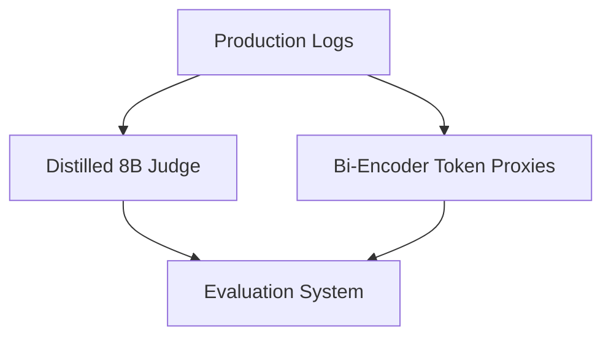

# The High Cost and Latency of Agentic LLM Evaluation

Evaluating millions of production queries using advanced LLMs (like GPT-4) is cost-prohibitive.

## Architectural Flow

## Mitigation
- Using lightweight, domain-specific evaluator models (e.g. Prometheus).
- Real-time heuristic proxies before batch judging.
