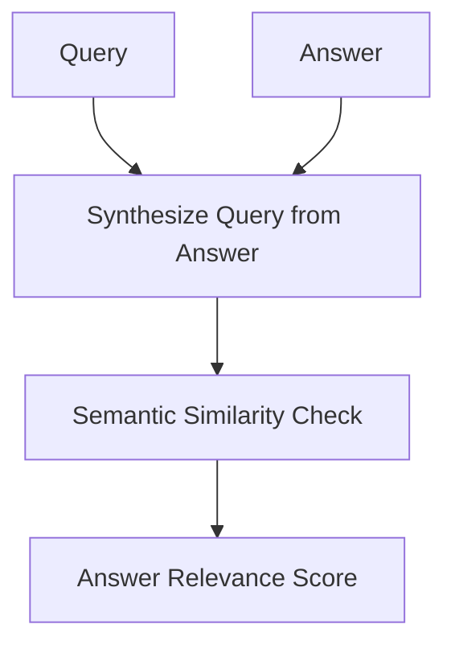

# Answer Relevance (Semantic Alignment)

Measures if the generated answer directly addresses the user query.

## Architectural Flow

## Mechanism
LLMs generate hypothetical questions for the answer, and measure similarity to the original query.
