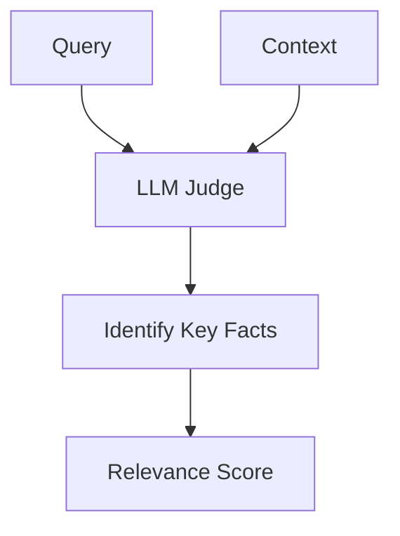

# Context Relevance (Precision Oversight)

Evaluates whether the retrieved context chunks contain only relevant info and exclude noise.

## Architectural Flow

## Mechanism
An LLM analyzes the query and the retrieved context to verify if all retrieved details are useful.
