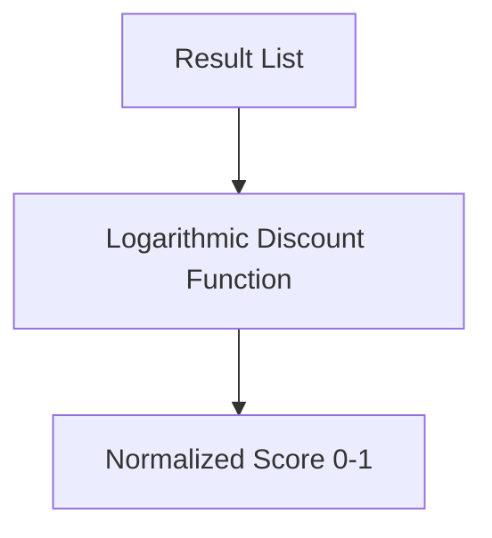

# The Continuous Relevance & Discounted Gain Era (~2000s–2022)

To accommodate graded relevance and position decay, researchers introduced discounted gain matrices, culminating in the widespread adoption of NDCG.

## Architectural Flow

## Detailed Explanation
- **Discounted Cumulative Gain (DCG)**: Graded relevance points are discounted logarithmically as rank increases.
- **Normalized Discounted Cumulative Gain (NDCG)**: Normalizes DCG against an Ideal DCG (IDCG).

### Key Significance
Allows search engines to be optimized for highly fine-grained relevance judgements (e.g. scale of 0 to 3).
