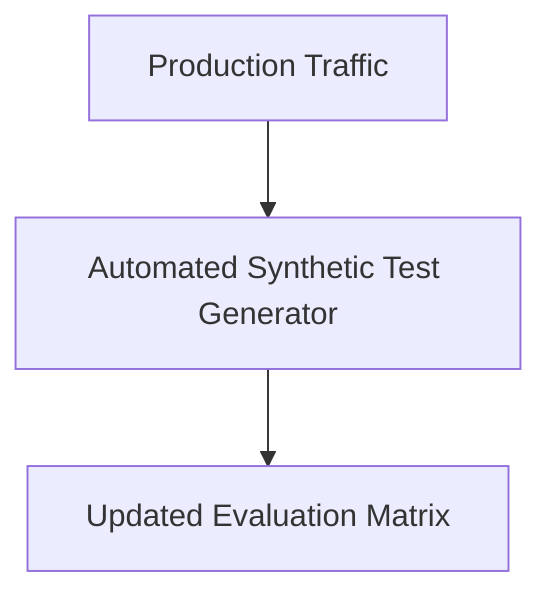

# The Data Contamination and Static Label Decay Wall

Static validation datasets decay rapidly as production data distributions change.

## Architectural Flow

## Mitigation
Using synthetic generators to constantly update target evaluation benchmarks dynamically.
