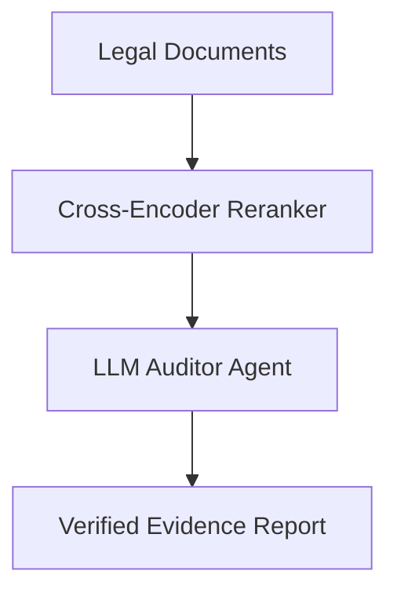

# Automated Corporate E-Discovery & Legal Audit Verification

Using retrieval systems to extract evidence or audit files in compliance investigations.

## Architectural Flow

## Application Details
Relies heavily on high-recall configurations with verification stages to prevent missed evidence.
