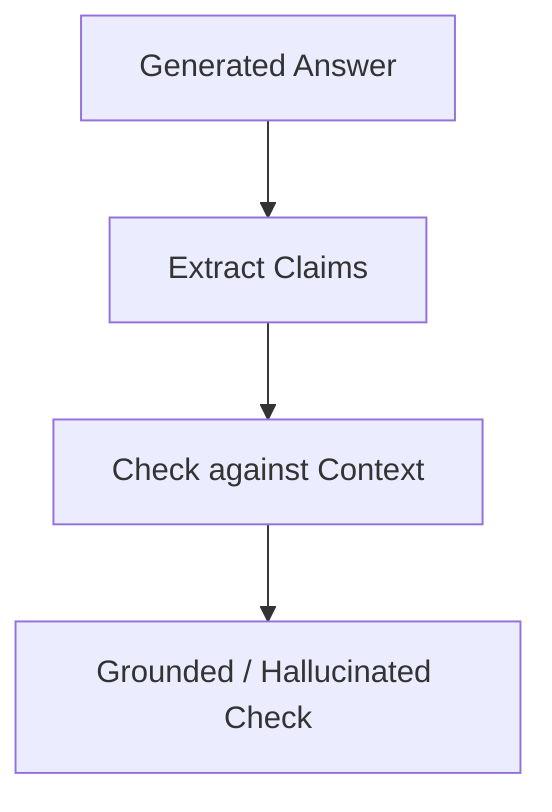

# Faithfulness / Groundedness (Hallucination Control)

Ensures that the LLM generation is strictly grounded in the retrieved context.

## Architectural Flow

## Mechanism
Calculates the fraction of claims made in the answer that can be directly verified from the context.
