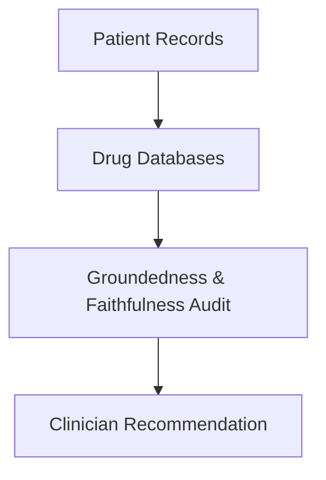

# High-Volume Healthcare Diagnostic Information Retrieval

Assisting clinical personnel by fetching records and pharmacology facts to suggest patient care steps.

## Architectural Flow

## Application Details
Demands 100% faithfulness scores to prevent medical liability or harm.
