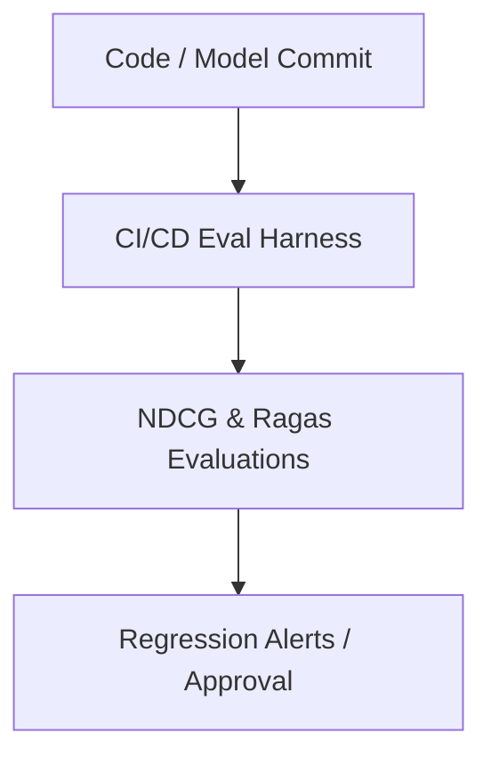

# Continuous MLOps Regression Tracking for Enterprise RAG Stacks

Ensures system improvements do not cause regressions in retrieval or generation quality.

## Architectural Flow

## Application Details
Automated evaluation testbeds run during continuous integration to ensure system quality does not decay.
