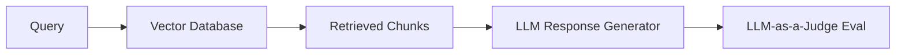

# The Model-Driven RAG Alignment Era (~2023–Present)

Modern RAG pipelines require evaluating the semantic alignment between queries, retrieved contexts, and generated answers. Standard lexical overlap metrics (like ROUGE or BLEU) fail here.

## Architectural Flow

## Detailed Explanation
LLM-as-a-Judge metrics (Ragas, TruLens, ARES) evaluate:
- **Context Relevance**
- **Faithfulness / Groundedness**
- **Answer Relevance**
