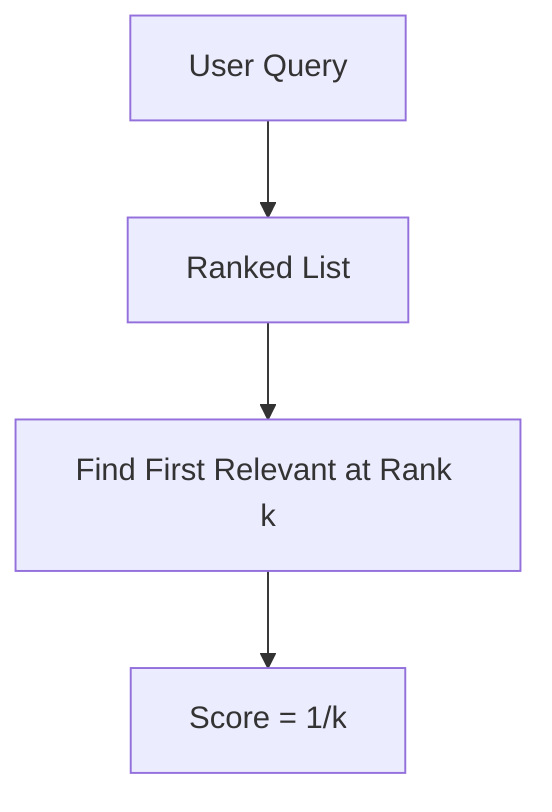

# Mean Reciprocal Rank (MRR)

MRR measures the system's ability to return the first correct answer as early as possible.

## Architectural Flow

## Formulas & Mechanism
$$\text{MRR} = \frac{1}{M} \sum_{i=1}^{M} \frac{1}{k_i}$$

### Applications
Used in FAQ engines, e-commerce product finders, and QA systems.
