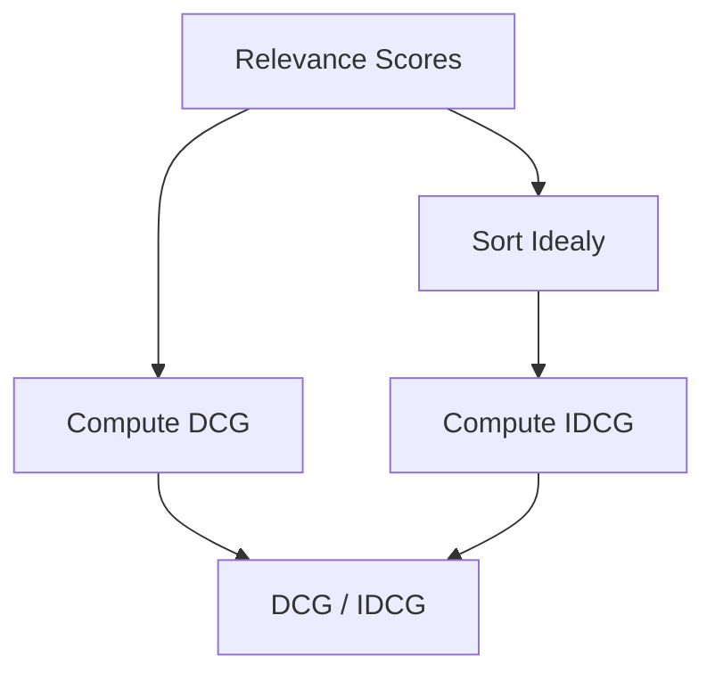

# Normalized Discounted Cumulative Gain (NDCG@K)

NDCG is the gold standard for ranked search evaluation using graded relevance labels.

## Architectural Flow

## Formulas & Mechanism
$$\text{DCG@K} = \sum_{i=1}^{K} \frac{2^{rel_i} - 1}{\log_2(i + 1)}$$
$$\text{NDCG} = \frac{\text{DCG}}{\text{IDCG}}$$
