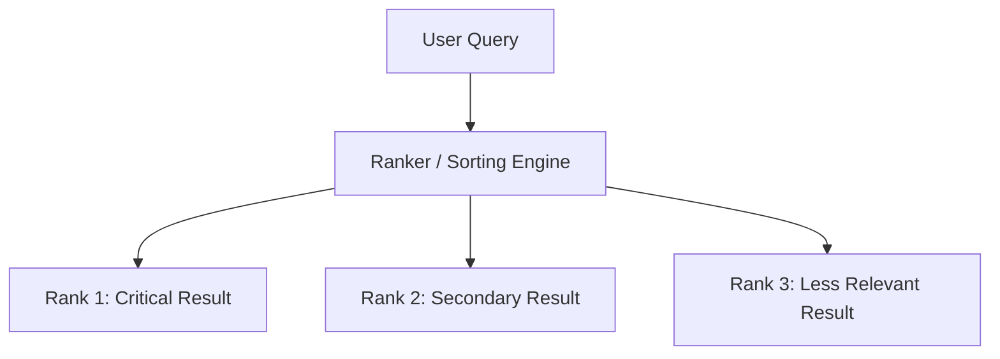

# The Rank-Sensitive Position Era (~1990s–2010s)

With the explosion of web search engines (Yahoo, early Google, etc.), user focus shifted heavily towards the top of the search result page. The order in which results were returned became critical.

## Architectural Flow

## Detailed Explanation
Metrics evolved to track position order:
- **Mean Reciprocal Rank (MRR)**: Focuses on the first relevant result.
- **Mean Average Precision (MAP)**: Averages precision values at each step where a relevant document is retrieved.

### Key Limitations
- **Binary Boundaries**: Still relied on binary relevance (either a document is 100% relevant or 0% relevant).
- **No Graded Utility**: Cannot capture nuances like 'partially relevant' documents.
