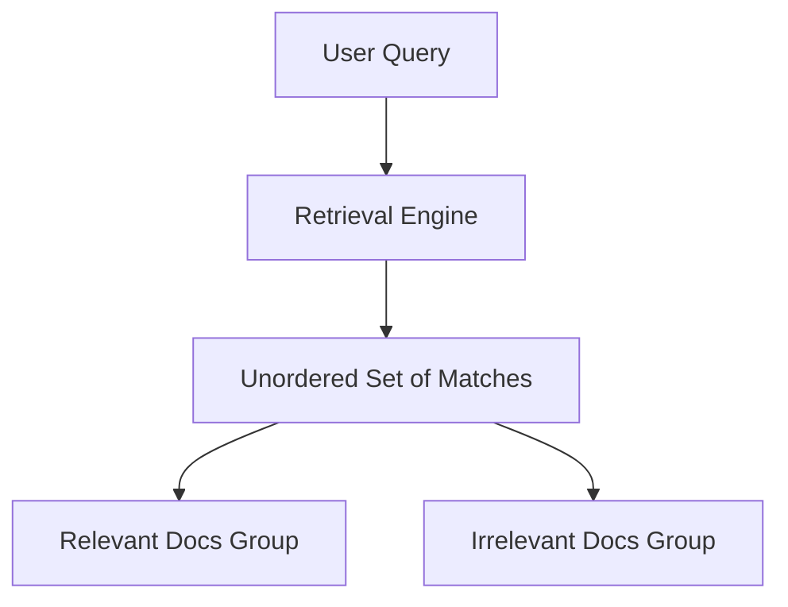

# The Un-ranked Set Era (Classical Information Retrieval, ~1960s–1990s)

During the dawn of computerized document indexing, information retrieval (IR) systems treated search results as unordered sets of documents rather than ranked lists. Users would input Boolean queries, and the system would return a bucket of matching documents.

## Architectural Flow

## Detailed Explanation
In this era, systems were evaluated using binary intersections:
- **Precision**: The proportion of retrieved documents that are relevant.
  $$\text{Precision} = \frac{|\text{Relevant} \cap \text{Retrieved}|}{|\text{Retrieved}|}$$
- **Recall**: The proportion of relevant documents that were successfully retrieved.
  $$\text{Recall} = \frac{|\text{Relevant} \cap \text{Retrieved}|}{|\text{Relevant}|}$$

### Key Limitations
- **Rank Blindness**: It treated all retrieved documents as equally positioned. If a perfect document was at index 50, it contributed the same to the score as if it were at index 1.
- **Set Size Dependency**: High variance based on the number of returned items.
